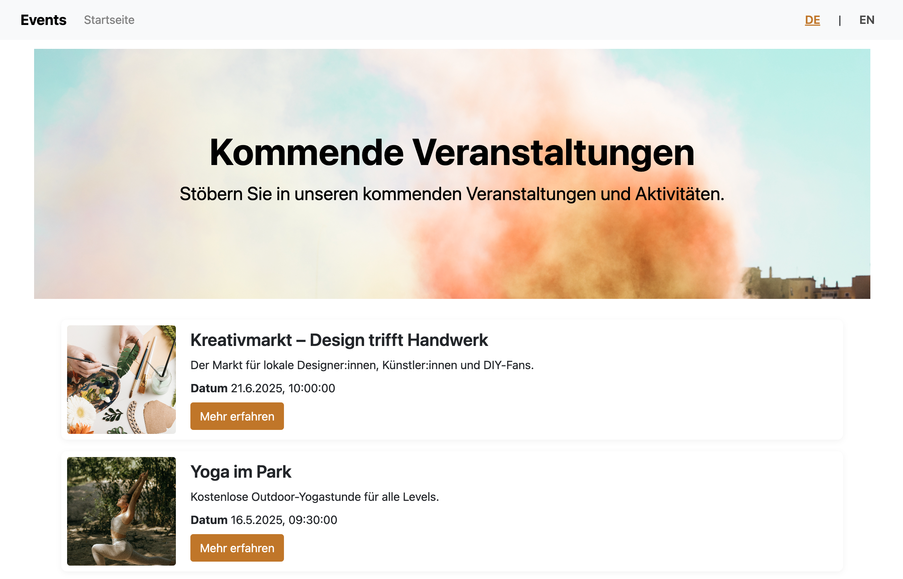

# Vergleich von Headless CMS – Praxisprojekte zur Bachelorarbeit

Dieses Repository enthält die drei praktischen Umsetzungen, die im Rahmen der Bachelorarbeit **„Headless CMS im Vergleich: Architekturanalyse, Einsatzgebiete und praktische Bewertung“** erstellt wurden. Es wurde ein Vergleich von dem Headless CMS [Strapi](https://strapi.io/), [Storyblok](https://www.storyblok.com/) und [Contentful](https://www.contentful.com/) durchgeführt.

## Projektstruktur
- [Strapi Projekt](strapi-vue): Frontend mit Vue.js + lokales Backend mit Strapi (self-hosted)
- [Storyblok Projekt](storyblok-vue): Frontend mit Vue.js + Inhalte via Storyblok API
- [Contentful Projekt](contentful-vue): Frontend mit Vue.js + Inhalte via Contentful API

## Verwendete Technologien
- Vue.js
- vue-i18n
- Bootstrap
- REST & GraphQL APIs
- Strapi (lokal)
- Storyblok (SaaS)
- Contentful (SaaS)

## Screenshot von einem fertigen Projekt

